# Manual de Usuario — Clínica Amazonas
### Sistema de Gestión de Citas Médicas

Este manual explica cómo usar el sistema día a día: agendar citas, hacer triaje, gestionar médicos y pacientes, la lista de espera, las alertas y los reportes gerenciales. Está organizado por rol, porque cada usuario ve un menú distinto según lo que le corresponde hacer.

### Novedades de esta actualización

- **Especialidades** (sección 4): el Administrador ahora puede **crear**, **editar** (nombre y precio juntos) y **desactivar** especialidades, no solo cambiar el precio.
- **Lista de espera** (sección 7): al anotar un paciente, el formulario ahora pide primero la **Especialidad** y recién después el **Médico** — el combo de médico se filtra automáticamente para mostrar solo los de la especialidad elegida.
- **Médicos** (sección 3): **Horarios** y **Descansos/Vacaciones** pasaron a ser de solo consulta para Recepcionista y Médico — únicamente el Administrador puede crearlos, editarlos o desactivarlos.
- **Alertas** (sección 8): un médico ahora ve solo las alertas dirigidas a él; ya no ve las del administrador ni las de otros pacientes.
- **Reportes** (sección 10): se agregó el indicador y el gráfico de **Tiempo de triaje promedio por especialidad** en la pestaña Tiempos.
- **General**: los formularios emergentes (crear, editar) ahora se pueden **arrastrar** tomando el título y moverlos a otra parte de la pantalla, por si tapan algo detrás que necesitas ver.

---

## 1. Ingreso al sistema

Al entrar a la aplicación se muestra la pantalla de inicio de sesión. Se ingresa con el correo y la contraseña que el administrador asignó al crear el usuario (recepcionista o médico) o con la cuenta de administrador.

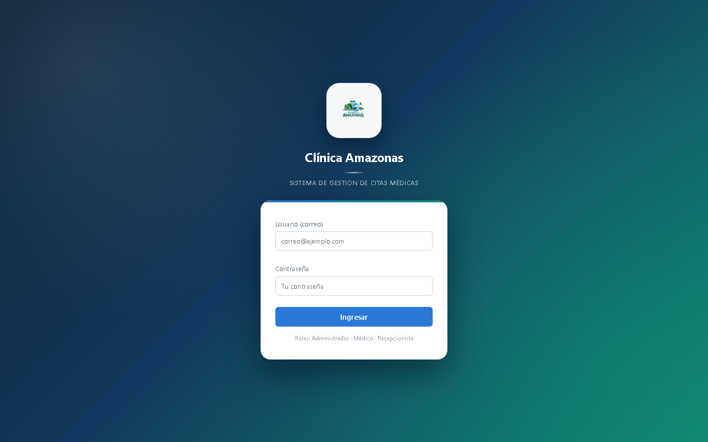

Al iniciar sesión, el sistema lleva automáticamente a la pantalla principal de cada rol:

| Rol | Pantalla de inicio | Para qué es |
|---|---|---|
| **Administrador** | Reportes | Ve todo el sistema: reportes gerenciales, pacientes, médicos, especialidades, citas, lista de espera y alertas. |
| **Recepcionista** | Citas | Gestiona la agenda del día a día: pacientes, médicos, citas, lista de espera y alertas. No ve Reportes ni Especialidades. |
| **Médico** | Mi agenda | Ve solo su propia agenda del día, el historial de sus pacientes, médicos/especialidades (solo lectura) y sus alertas. No gestiona citas de otros médicos ni ve Reportes. |

El menú de la izquierda solo muestra las secciones que el rol conectado puede usar — si falta una opción (por ejemplo "Reportes" para un recepcionista), es porque ese rol no tiene acceso a esa sección, no un error.

Para salir, el botón **Cerrar sesión** está arriba a la derecha en cualquier pantalla.

---

## 2. Pacientes

Sección **Pacientes**, disponible para Administrador, Recepcionista y Médico (el médico solo puede ver y buscar, no crear ni editar).

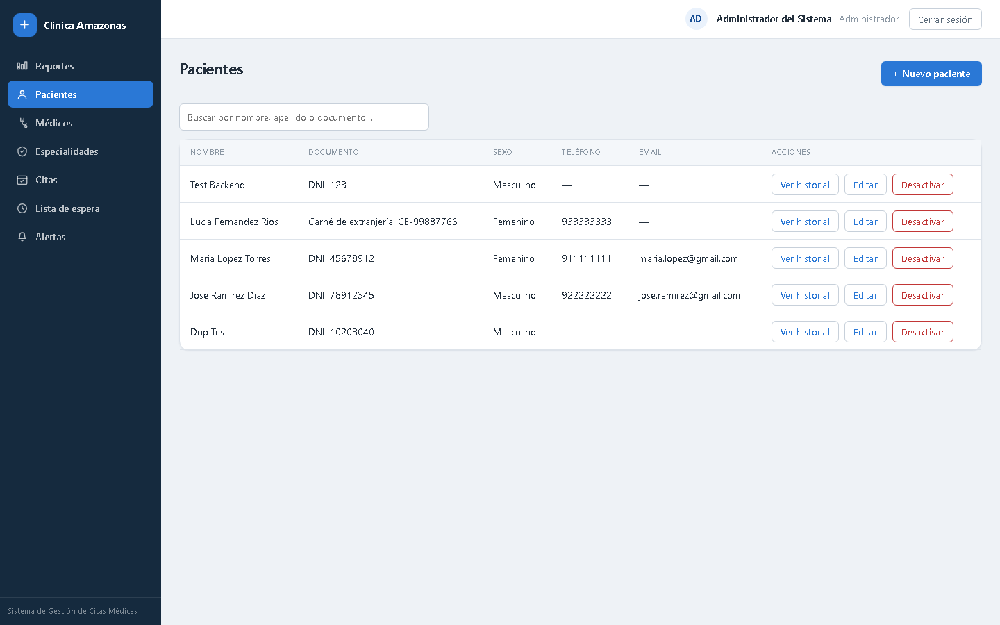

- El buscador de arriba filtra por nombre, apellido o número de documento.
- **Ver historial** muestra todas las citas anteriores de ese paciente, con cualquier médico.
- **Editar** / **Desactivar** están disponibles para Administrador y Recepcionista.

### Registrar un paciente nuevo

Botón **+ Nuevo paciente**.

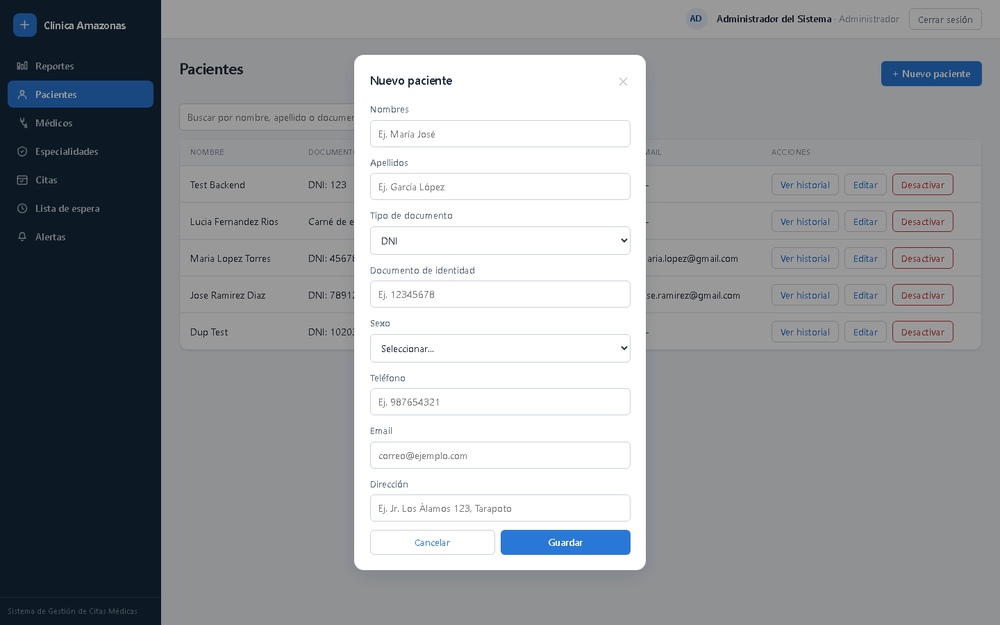

Campos:
- **Nombres** y **Apellidos** — obligatorios.
- **Tipo de documento** — DNI, Pasaporte, Carné de extranjería u Otros. Según lo que elijas acá cambia la validación del campo siguiente.
- **Documento de identidad** — si el tipo es **DNI**, debe tener exactamente 8 dígitos; para los demás tipos se acepta cualquier combinación alfanumérica de hasta 20 caracteres. El sistema no permite guardar dos pacientes con el mismo número de documento.
- **Sexo**, **Teléfono**, **Email**, **Dirección** — opcionales, pero el email es necesario si quieres que el paciente reciba las notificaciones automáticas (confirmación de cita, aviso de cupo liberado, etc.).

---

## 3. Médicos

Sección **Médicos** — el Administrador gestiona todo (registrar médicos, configurar horarios, registrar descansos); Recepcionista y Médico solo pueden consultar la lista y ver los horarios, sin poder editarlos.

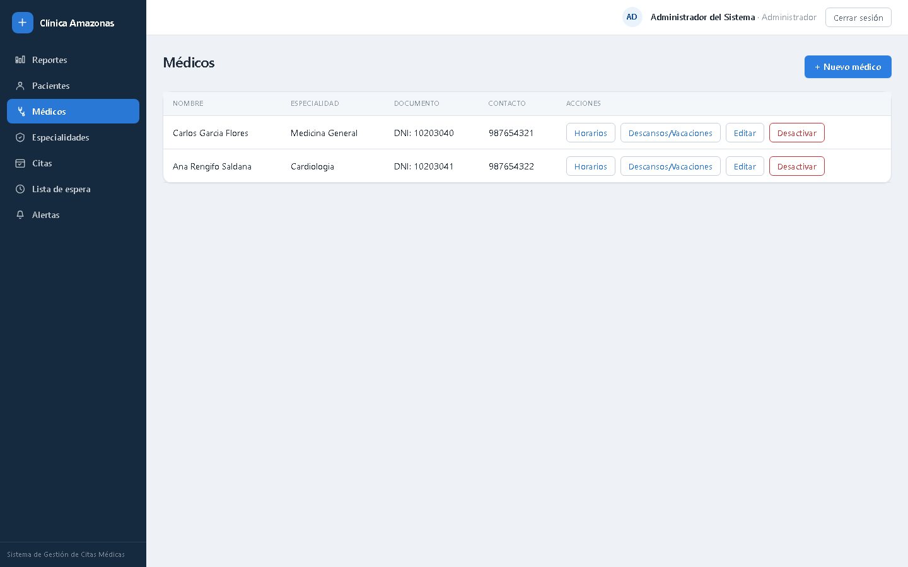

Por cada médico hay cuatro acciones, aunque no todas las ve cualquier rol: **Horarios** (todos los roles, pero solo el Administrador puede editar dentro de ese modal), **Descansos/Vacaciones**, **Editar** y **Desactivar** (estas tres últimas, solo Administrador).

### Registrar un médico nuevo

Solo el Administrador puede hacerlo. Botón **+ Nuevo médico**.

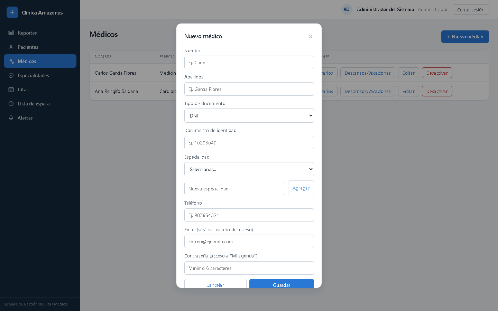

Además de los datos personales (mismo esquema de **Tipo de documento** que en Pacientes), este formulario crea también la cuenta de acceso del médico:
- **Especialidad** — se elige de la lista, o se puede crear una especialidad nueva directamente ahí mismo con el campo "Nueva especialidad..." + **Agregar**.
- **Email (será su usuario de acceso)** — con este correo el médico inicia sesión.
- **Contraseña (acceso a "Mi agenda")** — mínimo 6 caracteres; es la que el médico usará junto con su email para entrar al sistema.

### Configurar el horario semanal de un médico

Botón **Horarios** en la fila del médico — visible para los tres roles, pero solo el Administrador ve los controles para editarlo.

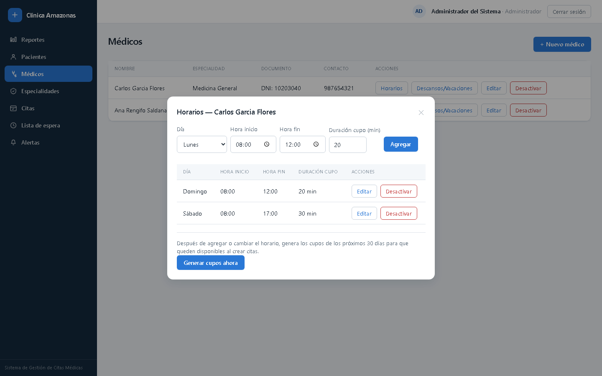

1. Elige el **día** de la semana, la **hora de inicio**, la **hora de fin** y la **duración de cada cupo** (en minutos) — por ejemplo, bloques de 20 minutos de 8:00 a 12:00 los lunes.
2. **Agregar** guarda ese bloque de disponibilidad. Puedes repetir el proceso para cada día que el médico atiende.
3. Cada horario ya guardado se puede **Editar** (cambiar hora o duración) o **Desactivar** (si el médico deja de atender ese día).
4. Después de crear o modificar un horario, presiona **Generar cupos ahora** — esto crea los cupos reales de citas disponibles para los próximos 30 días según ese horario. Si no se generan los cupos, el horario queda guardado pero no aparecerán espacios disponibles al momento de agendar una cita.

> **Importante:** si editas o desactivas un horario, el sistema elimina automáticamente los cupos futuros que ya no correspondan al nuevo horario (por ejemplo, si el médico deja de atender los martes, los cupos de martes que aún estaban libres desaparecen). Los cupos que ya tienen una cita reservada **nunca** se tocan, y los cupos de fechas pasadas tampoco se modifican.

Si entras como Recepcionista o Médico, el modal muestra la misma tabla de horarios pero con el aviso "Solo el administrador puede crear, editar o desactivar horarios. Esta vista es de solo consulta." — no aparecen el formulario ni los botones Editar/Desactivar/Generar cupos.

### Descansos y vacaciones

Botón **Descansos/Vacaciones** — solo lo ve el Administrador. Permite registrar un rango de fechas en el que el médico no atiende (vacaciones, licencia, etc.), independientemente de su horario semanal habitual.

---

## 4. Especialidades

Sección **Especialidades** — solo para el Administrador.

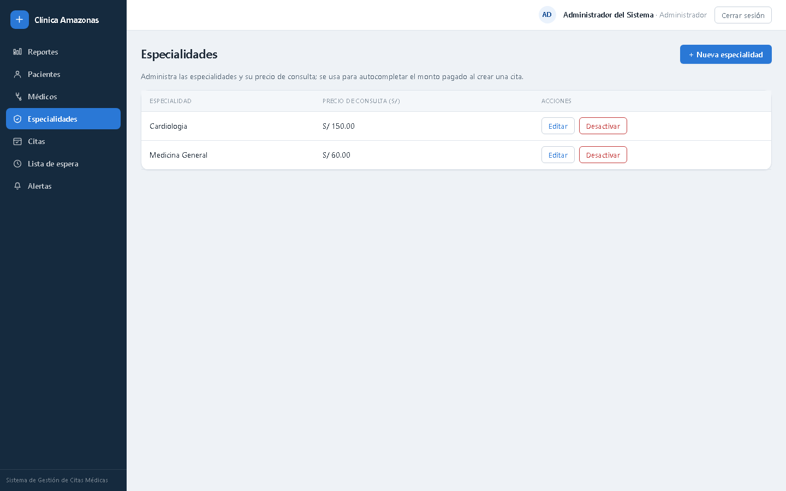

Cada especialidad tiene un **precio de consulta** asociado, que se usa como monto sugerido al agendar una cita paga y en los reportes financieros (ingresos y costos por especialidad).

### Crear una especialidad nueva

Botón **+ Nueva especialidad**.

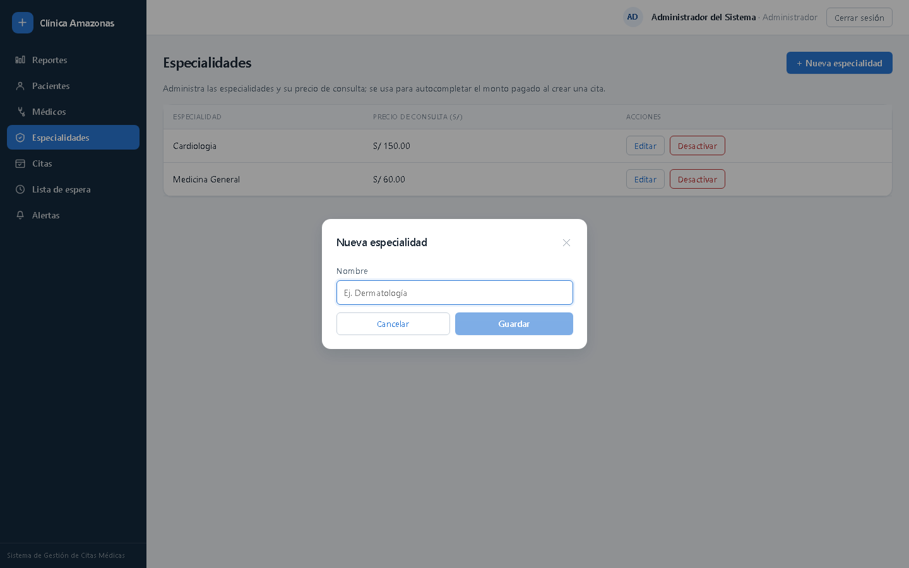

Solo pide el **Nombre** — no se permite repetir un nombre ya existente. (También se puede crear una especialidad al vuelo desde el formulario de "Nuevo médico", con el campo "Nueva especialidad...".)

### Editar o desactivar una especialidad

Botón **Editar** en la fila — permite cambiar el **nombre** y el **precio de consulta** juntos, directamente en la tabla.

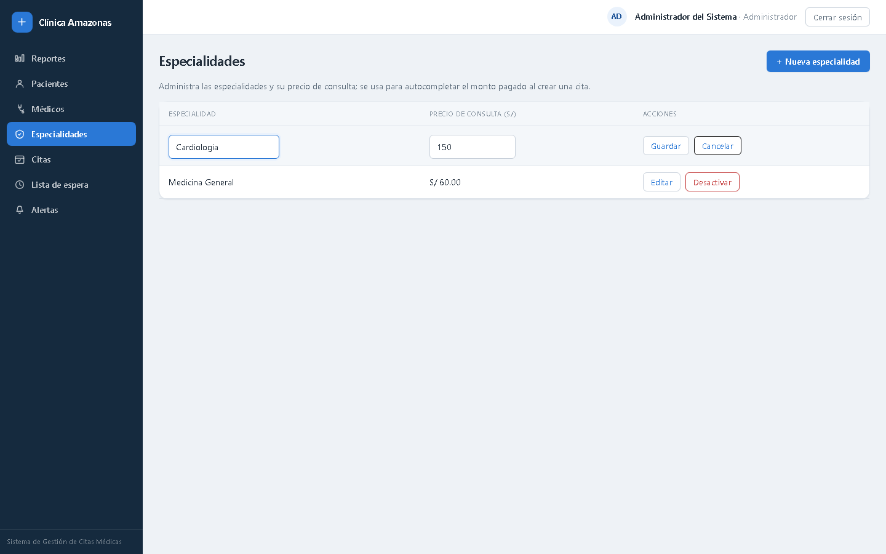

**Desactivar** la retira de los combos para asignarla a médicos nuevos, agendar citas o anotar en la lista de espera — pero no borra el historial: los médicos y citas que ya la tenían asignada la siguen mostrando con normalidad. El cambio de precio, en cualquier caso, no afecta las citas ya registradas, solo las nuevas.

---

## 5. Citas

Sección **Citas** — Administrador y Recepcionista. Es el corazón del día a día de recepción.

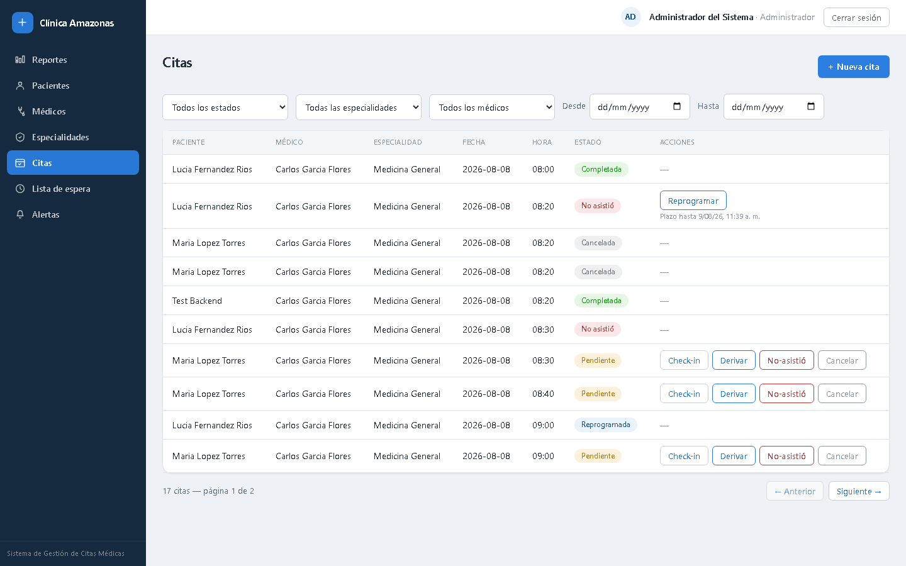

Los filtros de arriba (estado, especialidad, médico, rango de fechas) ayudan a encontrar citas rápido — por ejemplo, filtrar por "Confirmada (check-in)" para ver quiénes ya llegaron y están esperando pasar con el médico.

### Agendar una cita nueva

Botón **+ Nueva cita**.

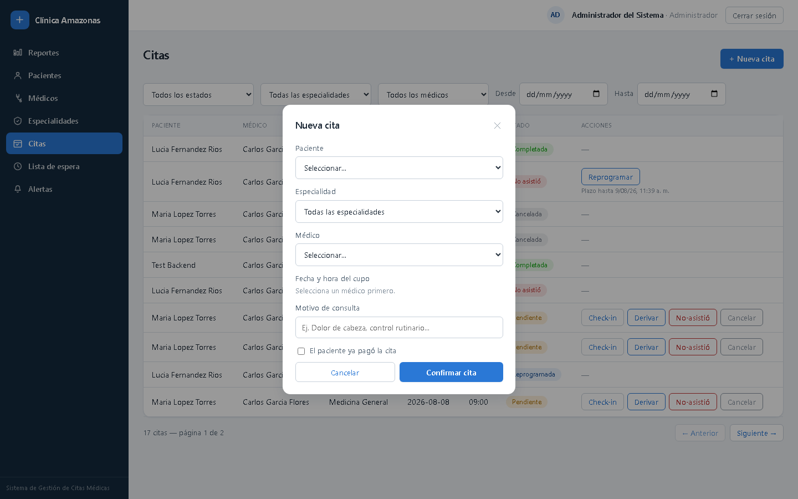

1. Elige el **Paciente**.
2. Elige la **Especialidad** (para ver solo médicos de esa especialidad) o directamente el **Médico**.
3. Selecciona la **fecha y hora del cupo** en el calendario que aparece — solo se muestran los cupos que ese médico tiene realmente disponibles según su horario.
4. **Motivo de consulta** — opcional, pero ayuda al médico a prepararse.
5. Si el paciente paga la cita, marca **"El paciente ya pagó la cita"** e indica el monto. Esto habilita la política de reprogramación de 24 horas (ver más abajo).
6. **Confirmar cita** — la cita queda en estado **Pendiente**, y si el paciente tiene email registrado, recibe un correo de confirmación.

### El ciclo de vida de una cita

Las acciones disponibles cambian según el estado de la cita:

| Estado | Qué significa | Acciones típicas |
|---|---|---|
| **Pendiente** | Se agendó pero el paciente aún no llega a recepción. | **Check-in** (cuando llega), **Derivar**, **No-asistió**, **Cancelar** |
| **Confirmada (check-in)** | El paciente ya llegó y está esperando. | **Triaje**, **Derivar**, **Iniciar consulta** (médico), **No-asistió**, **Cancelar** |
| **En curso** | El médico ya está atendiendo. | **Completar** (médico) |
| **Completada** | La consulta terminó. | — |
| **Cancelada** / **No asistió** | La cita no se realizó. | **Reprogramar**, solo si aún tiene derecho (ver política abajo) |
| **Reprogramada** | Se movió a otro horario/médico antes de llegar a atenderse; queda un registro nuevo enlazado. | — |

- **Check-in**: lo hace recepción cuando el paciente llega físicamente a la clínica.
- **Triaje**: aparece una vez que la cita está en "Confirmada". Ver sección 6.
- **Iniciar consulta** / **Completar**: los usa el médico (o el administrador). Al presionar, se pide confirmar la hora real en que empezó o terminó de atender — no tiene que ser exactamente el momento en que se hace clic, por si se registra unos minutos después.
- **Derivar**: mueve una cita Pendiente o Confirmada a otro horario o médico (por ejemplo, si el médico no va a poder atender ese día). La cita original queda marcada como "Reprogramada" y se crea una nueva.

### Política de cancelación y reprogramación (citas pagadas)

Esta regla solo aplica a citas marcadas como pagadas:

- **Primera falla** (cancelación o inasistencia): el pago **se reembolsa** automáticamente y el paciente tiene **24 horas** para reprogramar esa cita sin costo adicional, usando el botón **Reprogramar** que aparece en la fila.
- **Si no reprograma dentro de esas 24 horas**, el sistema marca el pago como perdido automáticamente (no hace falta que nadie lo haga a mano).
- **Segunda falla** (o si ya se venció el plazo anterior): el pago **se pierde**, y esa cita ya no se puede volver a reprogramar.

El sistema muestra este mensaje de advertencia antes de confirmar una cancelación, para que quien atiende en recepción sepa exactamente qué le va a pasar al pago del paciente.

Las citas **no pagadas** se cancelan o marcan como no-asistidas sin ninguna de estas restricciones.

---

## 6. Triaje

Se abre con el botón **Triaje** (o **Editar triaje** si ya se había empezado) en una cita en estado "Confirmada". Lo usan Administrador y Recepcionista.

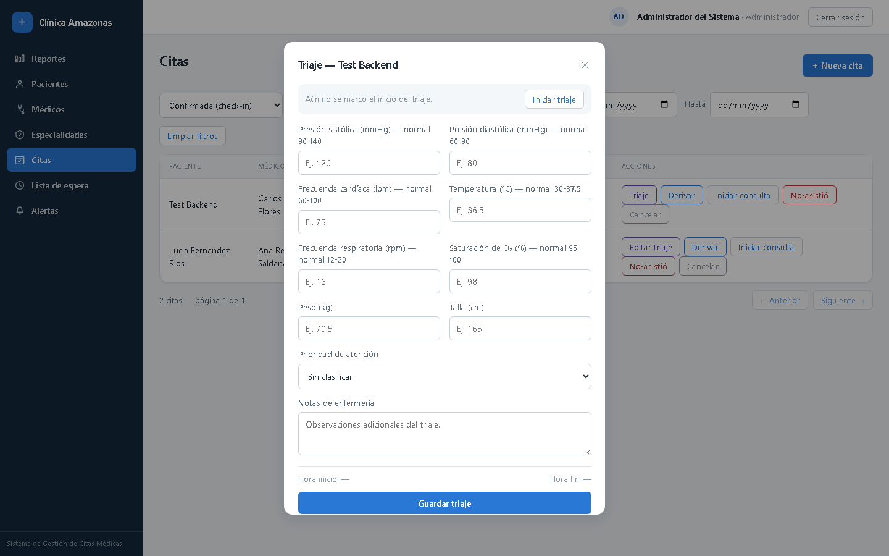

1. **Iniciar triaje** marca la hora en que se empieza a tomar los signos vitales. Se guarda de inmediato en el sistema — si cierras el modal sin terminar de llenar los datos, la hora de inicio no se pierde; al volver a abrir el triaje de esa cita, seguirá ahí.
2. Se registran los signos vitales: presión arterial, frecuencia cardíaca, temperatura, frecuencia respiratoria, saturación de oxígeno, peso y talla. Los campos que salen del rango normal (mostrado junto a cada etiqueta) se resaltan en rojo como aviso — esto no impide guardar, es solo una guía visual.
3. **Prioridad de atención** — clasifica qué tan urgente es el caso (Leve, Moderado, Urgente, Crítico), para que el médico sepa de un vistazo si debe atender a este paciente antes que a otros que están esperando.
4. **Notas de enfermería** — observaciones adicionales en texto libre.
5. **Guardar triaje** — al guardar, el sistema registra la hora de fin automáticamente (con el reloj del servidor, no el del navegador) y muestra la confirmación "Se terminó el triaje" junto con la hora de inicio y fin. Después de guardar, el botón cambia a **Cerrar**.

---

## 7. Lista de espera

Sección **Lista de espera** — Administrador y Recepcionista.

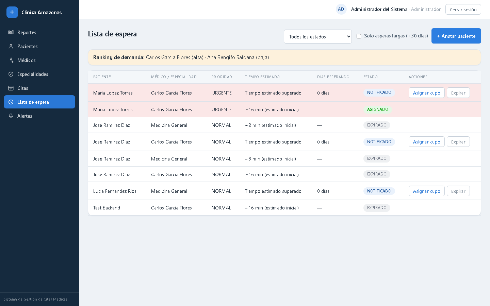

Sirve para anotar pacientes que quieren una cita pero no hay cupos disponibles en el momento, y notificarlos automáticamente en cuanto se libera uno.

El panel superior ("Ranking de demanda") muestra qué médicos tienen más o menos solicitudes en espera respecto al promedio, útil para decidir si conviene abrir más horarios de un médico en particular.

### Anotar un paciente

Botón **+ Anotar paciente**.

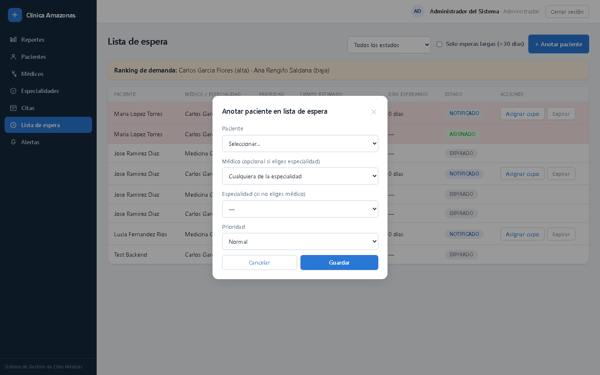

- Se elige el **Paciente**.
- Luego la **Especialidad** — al elegirla, el combo de **Médico** de abajo se filtra automáticamente y solo muestra los médicos de esa especialidad. Si dejas la especialidad en "Cualquiera", el combo de médico muestra a todos.
- **Médico** — opcional: elige uno puntual, o deja "Cualquiera" / "Cualquiera de la especialidad" si no importa cuál, mientras sea de la especialidad elegida.
- **Prioridad** — Normal o Urgente; los urgentes se notifican primero cuando hay varios esperando por el mismo médico o especialidad.

### Qué pasa cuando se libera un cupo

Cuando una cita se cancela o el paciente no asiste, el sistema revisa automáticamente la lista de espera:
- Si alguien pidió **ese médico específico**, se le avisa a esa persona.
- Si nadie pidió ese médico puntual pero hay alguien esperando **esa especialidad** en general, también se le avisa.
- Se elige siempre a quien tiene mayor prioridad y, entre iguales, a quien lleva más tiempo esperando.

El paciente pasa a estado **Notificado**, se genera una alerta (ver sección 8) y, si tiene email registrado, recibe un correo. Desde ahí, recepción puede:
- **Asignar cupo**: elegir el cupo liberado (u otro) y confirmar la cita para ese paciente — pasa a estado **Asignado**.
- **Expirar**: si el paciente ya no está interesado o no respondió a tiempo.

---

## 8. Alertas

Sección **Alertas** — Administrador, Recepcionista y Médico, pero cada quien ve solo las que le corresponden: un médico nunca ve las alertas dirigidas al administrador (inasistencia frecuente, sobrecarga de agenda, lista de espera larga) ni las de otros pacientes, aunque conozca su identificador.

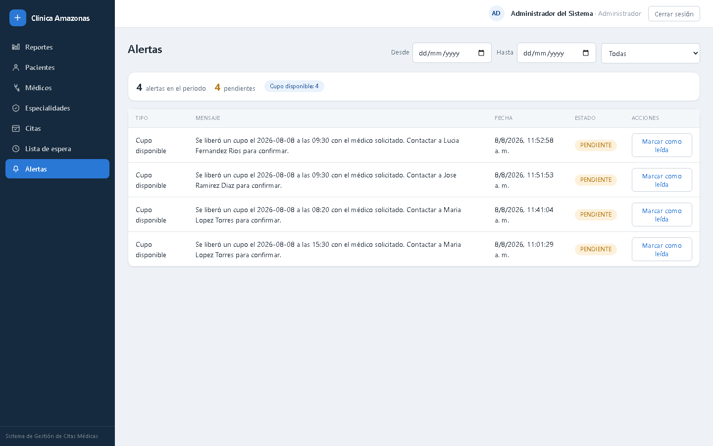

Tipos de alerta que genera el sistema automáticamente:
- **Cupo disponible** — se liberó un cupo y hay alguien en la lista de espera que calza con él (ver sección 7).
- **Inasistencia frecuente** — un paciente acumula varias inasistencias en poco tiempo; se avisa al administrador para que decida cómo manejarlo (por ejemplo, exigir pago adelantado).
- Recordatorios de citas próximas y avisos de sobrecarga de horario también se generan de forma automática en segundo plano.

Por ahora, todas las alertas automáticas se dirigen al paciente o al administrador — ningún tipo de alerta se genera todavía específicamente para un médico, así que su bandeja puede aparecer vacía; es el comportamiento correcto (ya no ve las ajenas), no un error.

**Marcar como leída** cambia el estado de la alerta a atendida, para llevar control de cuáles ya se gestionaron.

---

## 9. Mi agenda (solo Médico)

Pantalla de inicio del rol Médico. Muestra únicamente las citas del médico que inició sesión, para el día seleccionado.

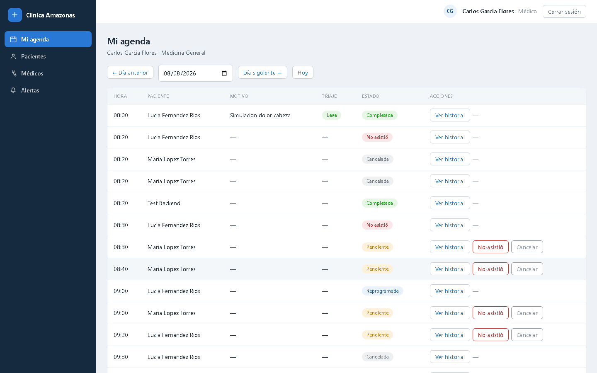

- **← Día anterior**, selector de fecha, **Día siguiente →** y **Hoy** para moverse entre fechas.
- La columna **Triaje** muestra la prioridad ya registrada por recepción (si la hay), para que el médico priorice a simple vista.
- **Ver historial** abre todas las citas anteriores de ese paciente, con cualquier médico — útil para tener contexto antes de atender.
- El médico puede marcar **No-asistió** o **Cancelar** sus propias citas, e **Iniciar consulta** / **Completar** cuando el paciente ya hizo check-in (ver sección 5). No puede tocar citas de otros médicos ni ver la agenda completa de la clínica.

---

## 10. Reportes (solo Administrador)

Sección **Reportes** — es la pantalla de inicio del Administrador. Da visibilidad gerencial del funcionamiento de la clínica.

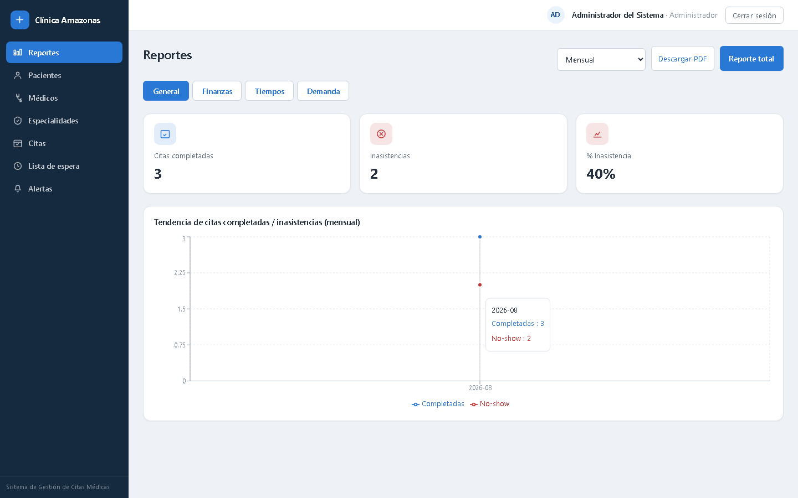

El combobox de arriba a la izquierda (Semanal / Mensual / Trimestral / Anual) cambia el periodo de todos los indicadores y gráficos de la pestaña activa. Hay cuatro pestañas:

- **General** — citas completadas, inasistencias, % de inasistencia y su tendencia en el tiempo.
- **Finanzas** — costos e ingresos por especialidad, especialidad más solicitada.

  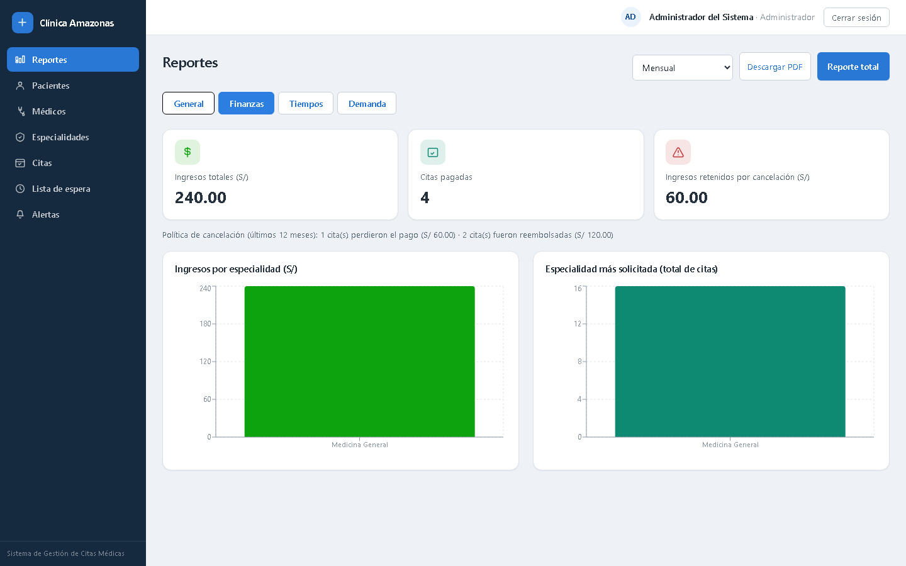

- **Tiempos** — tiempo de espera semanal por especialidad, tiempo promedio de consulta y tiempo promedio de triaje (desde que se marca "Iniciar triaje" hasta que se guardan los signos vitales) por especialidad.

  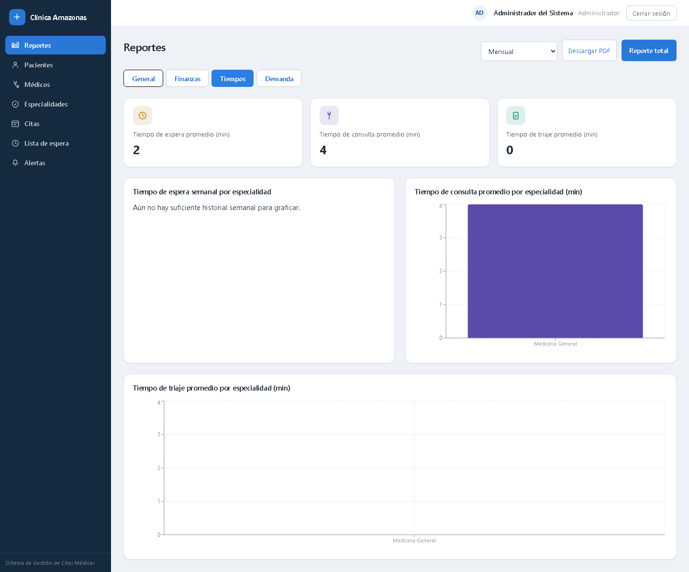

- **Demanda** — ranking de médicos por número de citas, ocupación por franja horaria, citas más concurridas.

  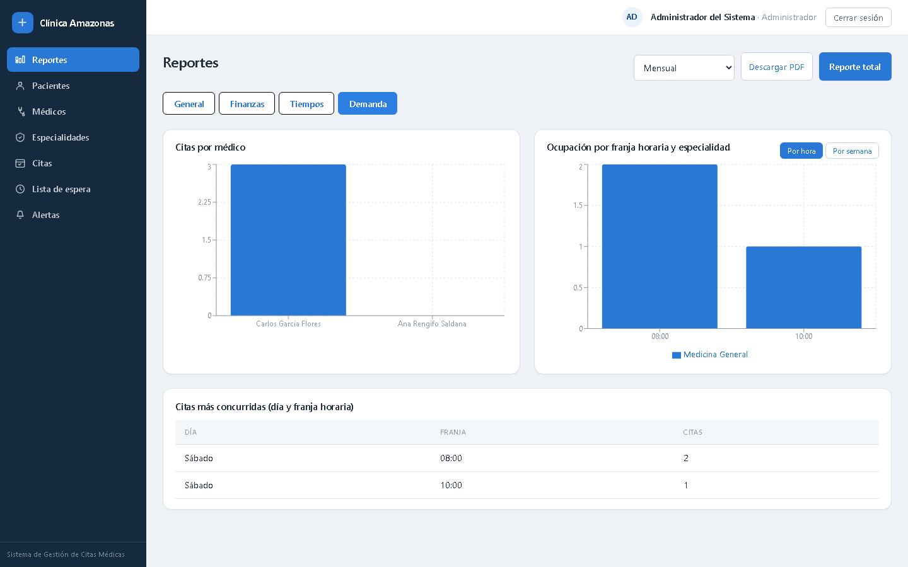

### Exportar a PDF

Dos botones arriba a la derecha:
- **Descargar PDF** — exporta solo la pestaña que se está viendo en ese momento, respetando el período seleccionado.
- **Reporte total** — exporta las cuatro pestañas juntas en un solo PDF, también respetando el período seleccionado.

Los indicadores de "Citas completadas" e "Inasistencias" se calculan en vivo directamente de las citas registradas — no hay que esperar a que pase un día para que se actualicen; una cita recién completada aparece de inmediato.

---

## 11. Roles — resumen de permisos

| Acción | Administrador | Recepcionista | Médico |
|---|:---:|:---:|:---:|
| Ver Reportes | ✅ | ❌ | ❌ |
| Crear/editar/desactivar Especialidades | ✅ | ❌ | ❌ (solo consulta) |
| Crear/editar Médicos, sus horarios y descansos | ✅ | ❌ (solo consulta) | ❌ (solo consulta) |
| Crear/editar Pacientes | ✅ | ✅ | ❌ (solo consulta) |
| Crear citas, check-in | ✅ | ✅ | ❌ |
| Registrar triaje | ✅ | ✅ | ❌ |
| Iniciar consulta / Completar | ✅ | ❌ | ✅ (solo sus propias citas) |
| Cancelar / No-asistió | ✅ | ✅ | ✅ (solo sus propias citas) |
| Reprogramar / Derivar cita | ✅ | ✅ | ❌ |
| Lista de espera (anotar, asignar, expirar) | ✅ | ✅ | ❌ (solo consulta) |
| Ver y marcar Alertas | ✅ | ✅ | ✅ (las suyas) |

---

## 12. Preguntas frecuentes

**¿Por qué no veo el botón "Nueva cita" / "Reportes" / etc.?**
Porque tu rol no tiene permiso para esa acción — revisa la tabla de la sección 11. Si crees que deberías tenerlo, pide al administrador que verifique tu usuario.

**Agendé una cita y el horario del médico ya no aparece disponible al día siguiente, ¿por qué?**
Los cupos se generan para los próximos 30 días cuando se crea o edita el horario de un médico (botón "Generar cupos ahora" en la sección 3). Si pasó ese lapso sin regenerar cupos, no habrá más horarios disponibles para agendar — hay que volver a generarlos.

**Cambié el horario de un médico y algunos cupos que estaban disponibles desaparecieron, ¿es un error?**
No — es el comportamiento esperado. Al modificar o desactivar un horario, el sistema limpia automáticamente los cupos futuros que ya no correspondan al horario nuevo, para que el calendario de "Nueva cita" no muestre horarios que en realidad ya no existen. Los cupos con una cita ya reservada nunca se eliminan.

**Un paciente canceló su cita pagada, ¿pierde el dinero?**
No en la primera falla: el pago se reembolsa y tiene 24 horas para reprogramar sin costo. Ver la política completa en la sección 5.

**¿Cómo sabe el sistema a quién avisar cuando se libera un cupo?**
Revisa la lista de espera: primero busca a alguien que pidió ese médico específico, y si no hay, a alguien que pidió esa especialidad en general. Avisa por alerta interna y, si el paciente tiene email registrado, también por correo.

**Desactivé una especialidad y ya no aparece para elegirla, ¿la perdí?**
No — sigue existiendo. Solo se retira de los combos para elegirla en cosas nuevas (nuevo médico, nueva cita, lista de espera). Los médicos y citas que ya la tenían asignada la siguen mostrando con normalidad.

---

*Este manual describe el sistema tal como funciona en la versión actual. Las capturas de pantalla corresponden al ambiente de pruebas de la Clínica Amazonas.*
